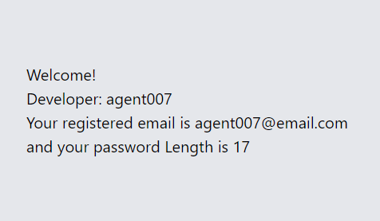
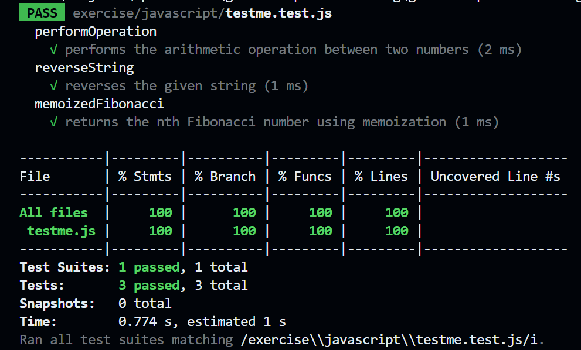

# GitHub Copilot Exercise Instructions

This is an excercise to complete a simple developer registration form exercise using GitHub Copilot. The objective is to build a simple form featuring a registration form with client-side validation and corresponding unit tests by asking GitHub Copilot for help.

## What you will build





## Getting Started

- Clone this repository from GitLab to your local machine and create a new branch.
- Suggested branch name: ghcp-exercise/your-name

## Time Required: 15 to 30 minutes

We will need to conclude the exercise at the 30 minute mark. If you are not able to complete the exercise, you can continue working on it after the session.

## Too simple?

Some of you may already be familiar on how to build this yourself. That's great! But the goal of this exercise is to see how GitHub Copilot can help you speed up the process and provide you with suggestions that you may not have thought of.

If you're feeling confident, here's a challenge: Try to time yourself and see how long it takes to complete the exercise without GitHub Copilot. Then, compare it to the time it takes with GitHub Copilot. Share your experience with the community!

## Empty files provided

Empty files are provided where you can paste the code snippets generated by GitHub Copilot. Part of the exercise is to identify which file to paste the code into. Feel free to add other files as needed.

## Exercise 1: Create the HTML Structure for the Registration Form

Requirement:

```
Create an HTML scaffolding with a form that accepts inputs for username, email, password, and a submit button.
```

### Public Code Block is enabled your organization (If applicable)
> Reminder: Public Code blocking is enabled in your organization. You may receive a message saying "Sorry, the response matched public code so it was blocked..."

A simple solution is to rephrase and change some of the names of the fields in your prompt. For example, you can change "username" to "developername" and "email" to "developeremail". This is just one way to work around the issue. Try to be creative and come up with your own ideas, and if successful, don't forget to share them with the community!

## Exercise 2: Style the Form with Tailwind CSS

Requirement:

```
Use Tailwind CSS classes for styling the form with rounded inputs and a prominent submit button. 
The form should be centered on the page with the appropriate padding and margin. 
Use labels for the input fields.
```

### If the response is incomplete...iterate

```
Ask Copilot: Generate the full HTML code with tailwind CSS requirement I have provided.
```

## Exercise 3: Implement Validation Functions in JavaScript

Requirements:

```
1.) Create a JavaScript function to validate a username as alphanumeric with a length of 4 to 12 characters.
```

```
2.) Write a JavaScript function to validate an email address using a standard email format.
```

```
3.) Write a JavaScript function to validate a password with a minimum of 8 characters including both letters and numbers.
```

```
4.) Ensure proper documentations and commenting of your code.
```

## Exercise 4: Integrate Validation Functions with the Form

Requirement:
```
Wire up the JavaScript function to validate input fields on form submission
```

> Tip: If your validation functions are in a separate file, ask Copilot how to reference that from index.html

> Tip: Not sure where to add the code? Ask Copilot. "Where do I need to add the JavaScript code to validate the form fields on submission?"

## Exercise 5: Display the entered information

Requirement:
```
Hide the form when the submission is successful and replace it with a div element that displays the user's information.

Welcome! Developer: [username] Your registerd email is [email] and your password length is [password lenght].
```


## Exercise 6: Generate Unit Tests for the Validation Functions

Requirement:

> Tip: Keep your js file containing your validation functions opened. This will give Copilot context to generate the tests.

```
Write Jest test cases for the following functions: `validateUsername`, `validateEmail`, and `validatePassword`.
```

> Question for you: Where do you usually save the suggested tests generated by Copilot?

```
Ask Copilot: What do I need in order to run Jest tests for the form validation functions?
```


## Exercise 7: Execute the Test and Review the results

```
Run the tests to ensure all validations are working as expected. Review the form in a web browser, test its functionality, and resolve any issues that arise.
```

> Tip: Not sure how to run the test? Ask Copilot "How do I run Jest tests for the form validation functions?"

Here's an example Jest test output when running the tests:



### Iterate and Improve

In case you get any errors, try to understand the issue and make the necessary changes to fix it. If you get stuck, use GitHub Copilot Chat to ask for help by pasting in the error message or code snippet into the Chat window.

---

## Important:

Makes sure that you have created a branch and committed your changes before starting and during the exercise. This will help you to track your progress and revert back to the original state if needed.