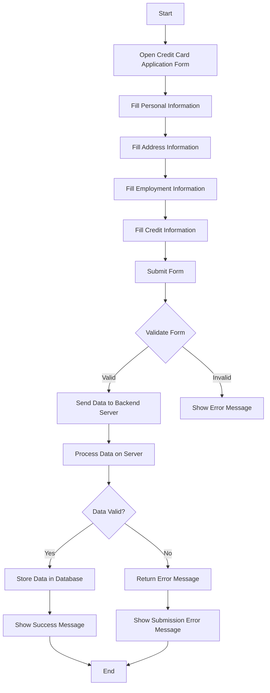

### Refined Requirement: Create a New Credit Card Application Form

#### Objective:
Develop a web-based credit card application form that allows users to apply for a credit card by providing their personal and financial information.

#### Functional Requirements:
1. **User Interface:**
   - The form should be user-friendly and responsive.
   - Use HTML5, CSS3, and JavaScript for the front-end.
   - Include form validation to ensure all required fields are filled out correctly.

2. **Form Fields:**
   - **Personal Information:**
     - Full Name (Text)
     - Date of Birth (Date Picker)
     - Social Security Number (Text, Masked Input)
     - Email Address (Email)
     - Phone Number (Text, Masked Input)
   - **Address Information:**
     - Street Address (Text)
     - City (Text)
     - State (Dropdown)
     - Zip Code (Text, Masked Input)
   - **Employment Information:**
     - Employer Name (Text)
     - Job Title (Text)
     - Annual Income (Number)
   - **Credit Information:**
     - Credit Score (Number)
     - Existing Credit Card (Yes/No Radio Buttons)
     - Existing Credit Card Limit (Number, Conditional on Yes)

3. **Form Validation:**
   - Ensure all required fields are filled out.
   - Validate email format.
   - Validate phone number format.
   - Validate Social Security Number format.
   - Validate numerical fields for income and credit score.

4. **Submission:**
   - On form submission, validate all fields.
   - Display a confirmation message upon successful submission.
   - Send form data to a backend server for processing (use a placeholder URL for now).

5. **Backend Integration:**
   - Use a RESTful API endpoint to handle form submissions.
   - The backend should validate the received data and store it in a database.
   - Return a success or error message based on the processing result.

#### Non-Functional Requirements:
1. **Security:**
   - Ensure data is transmitted securely using HTTPS.
   - Mask sensitive information like Social Security Number during input.
   - Implement server-side validation to prevent malicious data submission.

2. **Performance:**
   - The form should load quickly and be responsive.
   - Optimize images and assets to reduce load time.

3. **Accessibility:**
   - Ensure the form is accessible to users with disabilities.
   - Use ARIA labels and roles where necessary.

4. **Browser Compatibility:**
   - Ensure the form works on all major browsers (Chrome, Firefox, Safari, Edge).

#### Technologies:
- **Frontend:** HTML5, CSS3, JavaScript (or a framework like React/Vue.js)
- **Backend:** Node.js/Express (or any other backend technology)
- **Database:** MongoDB/MySQL (or any other database)

#### Deliverables:
1. Fully functional credit card application form.
2. Backend server to handle form submissions.
3. Documentation on how to deploy and use the form.

#### Timeline:
- **Week 1:** Design the form layout and structure.
- **Week 2:** Implement form fields and validation.
- **Week 3:** Develop backend server and integrate with the form.
- **Week 4:** Testing, bug fixing, and final deployment.

This refined requirement provides a comprehensive overview of the project, including both functional and non-functional aspects, ensuring clarity and completeness.

