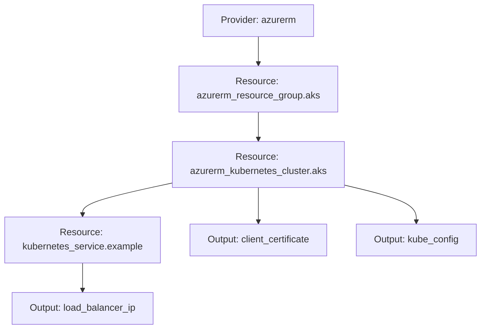

```mermaid
graph TD
    A[Provider: azurerm]
    B[Resource: azurerm_resource_group.aks]
    C[Resource: azurerm_kubernetes_cluster.aks]
    D[Resource: kubernetes_service.example]
    E[Output: client_certificate]
    F[Output: kube_config]
    G[Output: load_balancer_ip]
    A --> B
    B --> C
    C --> D
    C --> E
    C --> F
    D --> G
```